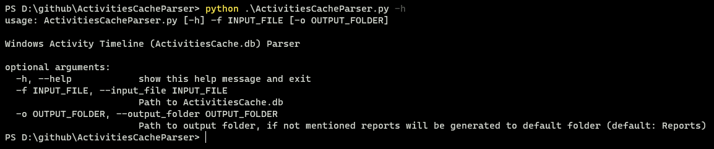

# ActivitiesCacheParser

**ActivitiesCacheParser** is a python tool to extract forensics data from ActivitiesCache.db (Windows Activity Timeline).

The database is located at `C:\Users\<user>\AppData\Local\ConnectedDevicesPlatform\<folder>\ActivitiesCache.db`.

`<folder>` can be any of the following based on the type of user account:

+ Local user account: L.< local user account name > (eg, `L.nihith`).
+ Microsoft account: Microsoft ID number (e.g., `cdd048cc6c17532e`).
    + Microsoft ID is located at `HKCU\software\Microsoft\IdentityCRL\UserExtendedProperties`
+ Azure Active Directory account: `AAD.XXXXX`.

This tool currently parses these tables from ActivitiesCache.db:
+ Activity
+ ActivityOperation
+ Activity_PackageId

## Requirements

Python 3.9 or above. The older versions of Python 3.x should work fine as well.

## Dependencies

These are the required libraries needed to run this script.

+ argparse
+ csv
+ os
+ sqlite3

## Usage

This is a CLI based tool.

```
$ python ActivitiesCacheParser.py -f <Path-to-ActivitiesCache.db>
```


To view help:

```bash
$ python ActivitiesCacheParser.py -h
```



Here is a small GIF showing how use the tool.


## References

Here are some of the resources referred while making this tool.

1. https://www.cellebrite.com/en/exploring-the-windows-activity-timeline-part-1-the-high-points/
2. https://blog.group-ib.com/windows10_timeline_for_forensics
3. https://kacos2000.github.io/WindowsTimeline/WindowsTimeline.pdf

Thanks to everyone for making their research public, this tool wouldn't be possible with out that <3.

## Author 👥

B. K. S. Nihith

+ Twitter: [@_Nihith](https://twitter.com/_Nihith)
+ Personal Blog: https://g4rud4.gitlab.io